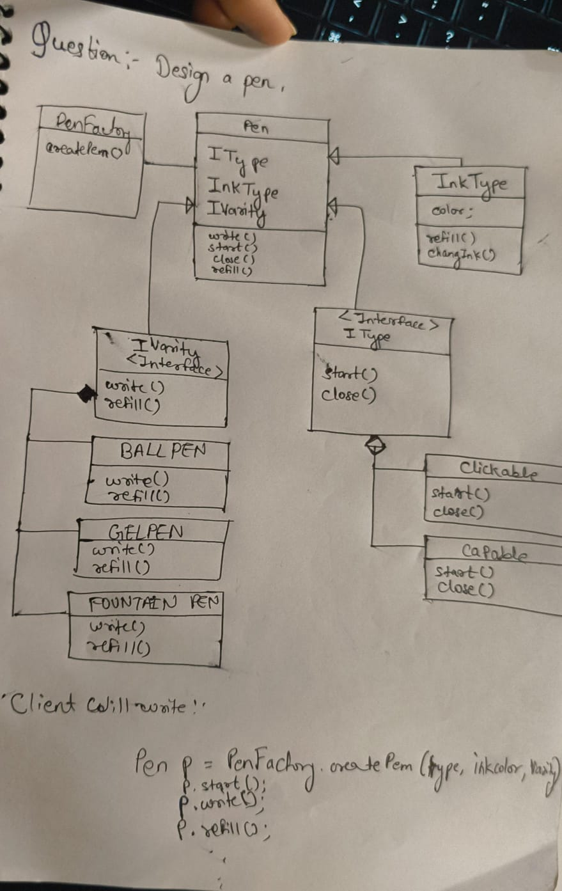

# DesigningPen — Object-Oriented Pen Designing System

## 1. Description
DesigningPen is a Java-based **Pen Designing System** built to demonstrate clean **Object-Oriented Design (OOD)** and the **Factory Design Pattern**.

The project models a pen as a composition of independent parts (mechanism, ink, and pen variety). By separating responsibilities into interfaces and concrete implementations, the system remains easy to extend (for example, adding a new pen type or a new mechanism) without modifying existing logic heavily.

## 2. Features
- **Multiple Pen Types**: Ball Pen, Gel Pen, Fountain Pen
- **Factory Pattern Implementation**: centralizes object creation in `PenFactory`
- **Interface-based Design**: behavior is defined via interfaces for loose coupling
- **Extensible Architecture**: add new pen varieties/mechanisms with minimal change
- **Clean OOP Implementation**: clear separation of concerns and responsibilities

## 3. Technologies Used
- **Java**
- **Object-Oriented Programming (OOP)**
- **Design Patterns** (Factory Pattern)

## 4. Project Structure

```
DesigningPen/
├── BallPen.java
├── GelPen.java
├── FountainPen.java
├── Pen.java
├── PenFactory.java
├── Main.java
├── Clickable.java
├── Capable.java
├── IPenType.java
├── IRefillType.java
├── IType.java
├── IVarity.java
├── InkFill.java
├── InkType.java
├── uml.jpg
└── README.md
```

## 5. UML Diagram
The UML diagram used as the reference design is included in the repository.



## 6. Class Relationships
Below is a conceptual view of how the main classes relate to each other.

### Composition
- **`Pen` → `InkType` (Composition)**
  - A `Pen` *owns* an `InkType` instance and uses it during `refill()`.
  - In this implementation the `InkType` object is created and passed into `Pen` via the factory and stored as a final dependency.

### Aggregation
- **`Pen` → `IType` (Aggregation)**
  - `Pen` *uses* a mechanism (`Clickable` / `Capable`) via the `IType` interface.

- **`Pen` → `IVarity` (Aggregation)**
  - `Pen` *uses* a pen variety (`BallPen` / `GelPen` / `FountainPen`) via the `IVarity` interface.

### Interface Implementation
- **`BallPen`, `GelPen`, `FountainPen` → `IVarity` (Interface Implementation)**
  - Each pen variety provides its own `write()` and `refill()` behavior.

- **`Clickable`, `Capable` → `IType` (Interface Implementation)**
  - Each mechanism defines how a pen is opened (`start()`) and closed (`close()`).

### Inheritance
- Java classes in this project mainly rely on **interfaces** rather than inheritance.
- Pen varieties are **not** implemented through inheritance from a base `Pen` class; instead, they implement `IVarity` and are composed into `Pen`.


## 7. Step-by-Step Implementation
1. **Create base interfaces**
   - Define contracts for behavior (for example, `IType` for mechanism and `IVarity` for pen variety).

2. **Create enum/types (conceptual)**
   - Identify the categories you want to vary: pen variety, mechanism type, ink color.
   - In this project, these are selected via strings in `Main` and interpreted by `PenFactory`.

3. **Create the core `Pen` class**
   - Build a `Pen` class that delegates behavior to its dependencies (`IType`, `IVarity`, `InkType`).

4. **Create Pen Types (Varieties)**
   - Implement:
     - `BallPen` (`IVarity`)
     - `GelPen` (`IVarity`)
     - `FountainPen` (`IVarity`)

5. **Create Refill / Ink classes**
   - Model ink behavior in `InkType` (color, refill, change ink).
   - `InkFill` implements `IRefillType` (available for extension).

6. **Implement Factory Pattern**
   - `PenFactory` creates the correct `IVarity` and `IType` based on user input.
   - It then assembles and returns a fully constructed `Pen`.

7. **Create the `Main` class**
   - Read inputs (variety, mechanism, ink color).
   - Use `PenFactory` to get a ready-to-use `Pen` instance.

8. **Test the implementation**
   - Validate that each combination (variety + mechanism + ink) works as expected.

## 8. Design Patterns Used
### Factory Design Pattern
The **Factory Pattern** encapsulates object creation logic inside a dedicated class (`PenFactory`).

**Why it is used here:**
- Keeps object-creation logic out of `Main`
- Makes it easier to add new pen types or mechanisms
- Improves maintainability by centralizing creation rules

## 9. Learning Outcomes
- Applying **OOP principles** (abstraction, encapsulation, composition, polymorphism)
- Using **interfaces** for loose coupling and extensibility
- Implementing and understanding the **Factory Design Pattern**
- Organizing a small project with **clean architecture** and clear responsibilities

```

## 11. Author
**Author:** Khushboo

Solution:
The solution is implemented in Java, following the principles of Object-Oriented Design (OOD) and utilizing the Factory Design Pattern to create a flexible and extensible pen designing system. The main components include interfaces for pen types and mechanisms, concrete implementations for different pen varieties, and a factory class to handle object creation based on user input. The design allows for easy addition of new pen types or mechanisms without modifying existing code, adhering to the Open/Closed Principle. The `Main` class serves as the entry point, where user input is processed to create and use the desired pen configuration. The UML diagram provided in the repository illustrates the relationships between classes and interfaces, showcasing the composition, aggregation, and interface implementation used in the design. Overall, the solution demonstrates a well-structured approach to modeling a pen designing system using OOD principles and design patterns.


